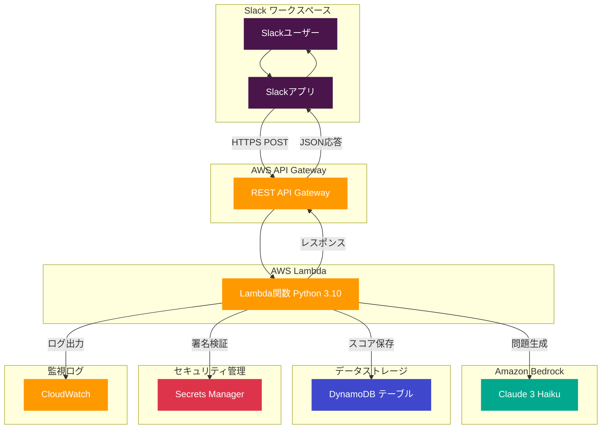
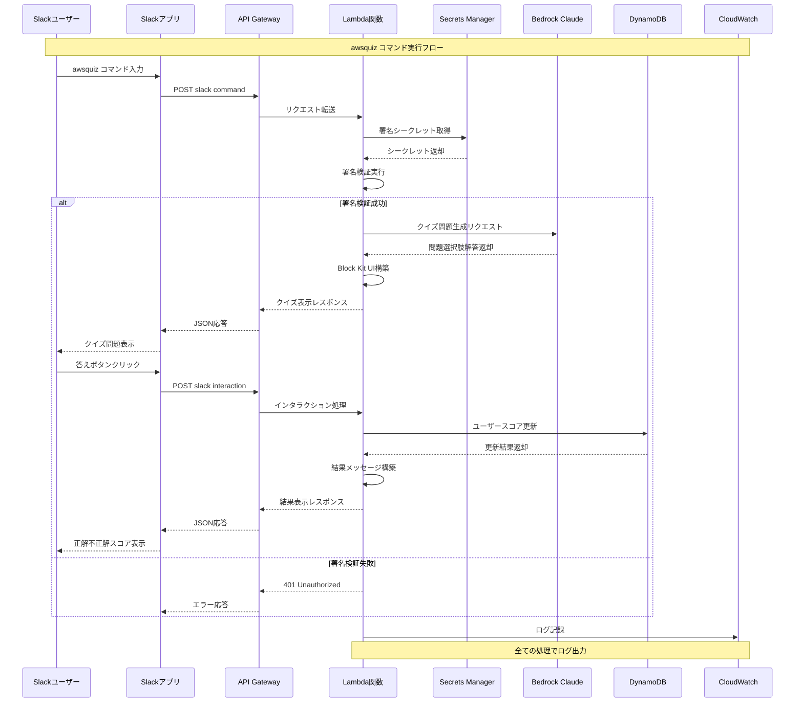
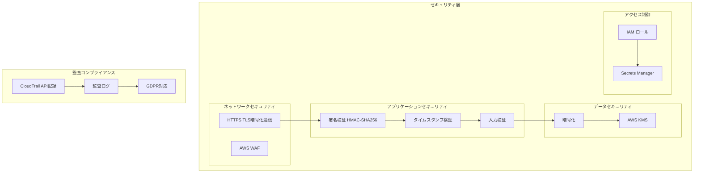
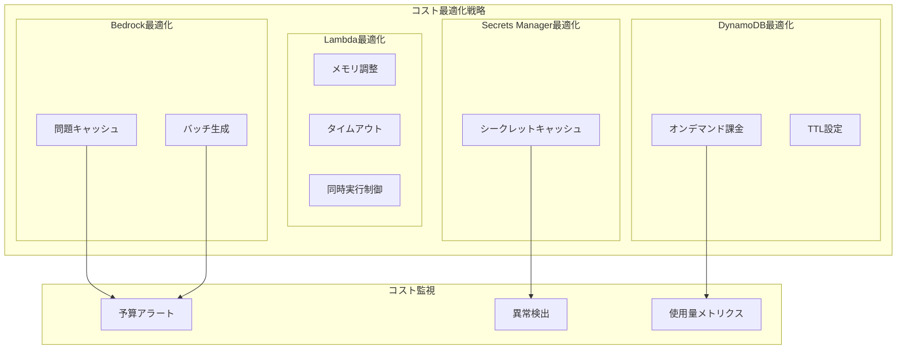
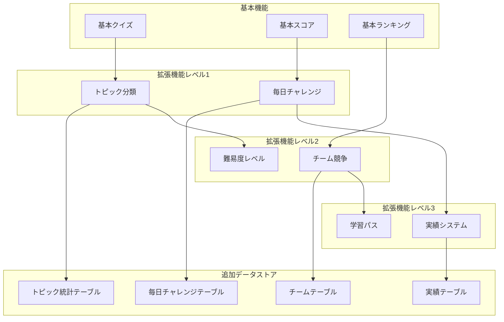

# Amazon Q + Slack クイズアプリケーション アーキテクチャ図

## システム全体アーキテクチャ

## データフロー詳細図

## セキュリティアーキテクチャ図

## コスト最適化アーキテクチャ

## 拡張機能アーキテクチャ

## AWS公式アイコン使用ガイド

### 使用したAWSサービスアイコン
- **Amazon API Gateway**: REST APIエンドポイント
- **AWS Lambda**: サーバーレス関数実行
- **Amazon DynamoDB**: NoSQLデータベース
- **Amazon Bedrock**: 生成AI機械学習
- **AWS Secrets Manager**: 認証情報管理
- **Amazon CloudWatch**: 監視ログ記録
- **AWS KMS**: 暗号化キー管理
- **AWS WAF**: Webアプリケーションファイアウォール
- **AWS CloudTrail**: API監査ログ

### アーキテクチャ図の特徴
1. **日本語ラベル**: すべてのコンポーネントが日本語で説明
2. **視覚的階層**: 機能別にグループ化された明確な構造
3. **データフロー**: 矢印で示された明確な処理の流れ
4. **セキュリティ重視**: セキュリティ層が明確に分離
5. **拡張性**: 将来の機能拡張を考慮した設計

この架構図は、AWS Well-Architected Frameworkの5つの柱（運用性、セキュリティ、信頼性、パフォーマンス効率、コスト最適化）に基づいて設計されています。