# Amazon Q + Slack クイズアプリケーション アーキテクチャ図

## システム全体アーキテクチャ

```mermaid
graph TB
    %% スタイル定義
    classDef slackStyle fill:#4A154B,stroke:#4A154B,stroke-width:2px,color:#fff
    classDef awsService fill:#FF9900,stroke:#FF9900,stroke-width:2px,color:#fff
    classDef database fill:#3F48CC,stroke:#3F48CC,stroke-width:2px,color:#fff
    classDef security fill:#DD344C,stroke:#DD344C,stroke-width:2px,color:#fff
    classDef ai fill:#01A88D,stroke:#01A88D,stroke-width:2px,color:#fff

    %% Slack層
    subgraph "Slack ワークスペース"
        SlackUser[👤 Slackユーザー]
        SlackApp[📱 Slackアプリ]
    end

    %% AWS API Gateway
    subgraph "AWS API Gateway"
        APIGateway[🌐 REST API<br/>- /slack/command<br/>- /slack/interaction]
    end

    %% AWS Lambda
    subgraph "AWS Lambda"
        LambdaFunction[⚡ Lambda関数<br/>Python 3.10<br/>256MB / 30秒]
    end

    %% AWS Bedrock
    subgraph "Amazon Bedrock"
        BedrockClaude[🤖 Claude 3 Haiku<br/>クイズ問題生成]
    end

    %% データストレージ
    subgraph "データストレージ"
        DynamoDB[🗄️ DynamoDB<br/>QuizScoresテーブル<br/>- user_id (PK)<br/>- score<br/>- total_questions]
    end

    %% セキュリティ
    subgraph "セキュリティ管理"
        SecretsManager[🔐 Secrets Manager<br/>- Slack署名シークレット<br/>- SlackボットToken]
    end

    %% 監視・ログ
    subgraph "監視・ログ"
        CloudWatch[📊 CloudWatch<br/>- ログ記録<br/>- メトリクス監視<br/>- アラート設定]
    end

    %% データフロー
    SlackUser --> SlackApp
    SlackApp -->|HTTPS POST| APIGateway
    APIGateway --> LambdaFunction
    
    LambdaFunction -->|署名検証| SecretsManager
    LambdaFunction -->|問題生成| BedrockClaude
    LambdaFunction -->|スコア保存/取得| DynamoDB
    LambdaFunction -->|ログ出力| CloudWatch
    
    LambdaFunction -->|レスポンス| APIGateway
    APIGateway -->|JSON応答| SlackApp
    SlackApp --> SlackUser

    %% スタイル適用
    class SlackUser,SlackApp slackStyle
    class APIGateway,LambdaFunction awsService
    class DynamoDB database
    class SecretsManager security
    class BedrockClaude ai
    class CloudWatch awsService
```

## 詳細コンポーネント図

```mermaid
graph LR
    %% Slack Commands
    subgraph "Slackコマンド"
        QuizCmd[/awsquiz<br/>📝 クイズ開始]
        LeaderCmd[/leaderboard<br/>🏆 ランキング表示]
    end

    %% Lambda処理フロー
    subgraph "Lambda処理フロー"
        Verify[🔍 署名検証]
        Parse[📋 リクエスト解析]
        Generate[🎯 問題生成]
        Store[💾 データ保存]
        Response[📤 応答生成]
    end

    %% DynamoDBデータモデル
    subgraph "DynamoDBデータ構造"
        UserRecord[ユーザーレコード<br/>user_id: U1234567890<br/>score: 15<br/>total_questions: 20<br/>last_updated: timestamp<br/>accuracy_rate: 0.75]
        GSI[グローバルセカンダリインデックス<br/>ScoreIndex<br/>score (Hash Key)]
    end

    %% Block Kit UI
    subgraph "Slack Block Kit UI"
        QuizBlock[📱 クイズ表示<br/>- 問題文<br/>- 4つの選択肢ボタン]
        ResultBlock[✅ 結果表示<br/>- 正解/不正解<br/>- 解説<br/>- 現在のスコア]
        LeaderBlock[🏆 ランキング表示<br/>- トップ5<br/>- 個人順位]
    end

    QuizCmd --> Verify
    LeaderCmd --> Verify
    Verify --> Parse
    Parse --> Generate
    Generate --> Store
    Store --> Response
    Response --> QuizBlock
    Response --> ResultBlock
    Response --> LeaderBlock
    
    Store --> UserRecord
    UserRecord --> GSI
```

## データフロー詳細図

```mermaid
sequenceDiagram
    participant U as 👤 Slackユーザー
    participant S as 📱 Slackアプリ
    participant A as 🌐 API Gateway
    participant L as ⚡ Lambda関数
    participant SM as 🔐 Secrets Manager
    participant B as 🤖 Bedrock Claude
    participant D as 🗄️ DynamoDB
    participant C as 📊 CloudWatch

    Note over U,C: /awsquiz コマンド実行フロー

    U->>S: /awsquiz コマンド入力
    S->>A: POST /slack/command
    A->>L: リクエスト転送
    
    L->>SM: 署名シークレット取得
    SM-->>L: シークレット返却
    L->>L: 署名検証実行
    
    alt 署名検証成功
        L->>B: クイズ問題生成リクエスト
        B-->>L: 問題・選択肢・解答返却
        L->>L: Block Kit UI構築
        L-->>A: クイズ表示レスポンス
        A-->>S: JSON応答
        S-->>U: クイズ問題表示
        
        U->>S: 答えボタンクリック
        S->>A: POST /slack/interaction
        A->>L: インタラクション処理
        
        L->>D: ユーザースコア更新
        D-->>L: 更新結果返却
        L->>L: 結果メッセージ構築
        L-->>A: 結果表示レスポンス
        A-->>S: JSON応答
        S-->>U: 正解/不正解 + スコア表示
        
    else 署名検証失敗
        L-->>A: 401 Unauthorized
        A-->>S: エラー応答
    end
    
    L->>C: ログ記録
    Note over L,C: 全ての処理でログ出力
```



## セキュリティアーキテクチャ図

```mermaid
graph TB
    subgraph "セキュリティ層"
        subgraph "ネットワークセキュリティ"
            HTTPS[🔒 HTTPS/TLS 1.2+<br/>暗号化通信]
            WAF[🛡️ AWS WAF<br/>- レート制限<br/>- IP評価<br/>- 攻撃パターン検出]
        end
        
        subgraph "アプリケーションセキュリティ"
            SigVerify[✍️ 署名検証<br/>HMAC-SHA256]
            TimeCheck[⏰ タイムスタンプ検証<br/>5分間ウィンドウ]
            InputValid[🔍 入力検証<br/>サニタイゼーション]
        end
        
        subgraph "データセキュリティ"
            Encryption[🔐 暗号化<br/>- 転送時暗号化<br/>- 保存時暗号化]
            KMS[🗝️ AWS KMS<br/>暗号化キー管理]
        end
        
        subgraph "アクセス制御"
            IAM[👥 IAM ロール<br/>最小権限の原則]
            SecretsMgr[🔑 Secrets Manager<br/>認証情報管理]
        end
    end

    subgraph "監査・コンプライアンス"
        CloudTrail[📋 CloudTrail<br/>API呼び出し記録]
        AuditLog[📝 監査ログ<br/>ユーザー操作記録]
        GDPR[🇪🇺 GDPR対応<br/>- データ削除<br/>- データエクスポート]
    end

    HTTPS --> SigVerify
    SigVerify --> TimeCheck
    TimeCheck --> InputValid
    InputValid --> Encryption
    Encryption --> KMS
    IAM --> SecretsMgr
    
    CloudTrail --> AuditLog
    AuditLog --> GDPR
```



## コスト最適化アーキテクチャ

```mermaid
graph TB
    subgraph "コスト最適化戦略"
        subgraph "Bedrock最適化 (82.1%のコスト)"
            Cache[📦 問題キャッシュ<br/>- 50問事前生成<br/>- 70%コスト削減]
            Batch[📊 バッチ生成<br/>- 定時一括生成<br/>- 80%コスト削減]
        end
        
        subgraph "Lambda最適化 (6.5%のコスト)"
            Memory[🧠 メモリ調整<br/>256MB最適設定]
            Timeout[⏱️ タイムアウト<br/>30秒設定]
            Concurrent[🔄 同時実行制御<br/>1000並行処理]
        end
        
        subgraph "DynamoDB最適化 (0.1%のコスト)"
            OnDemand[💳 オンデマンド課金<br/>使用量ベース]
            TTL[🗓️ TTL設定<br/>古いデータ自動削除]
        end
        
        subgraph "Secrets Manager最適化 (11.3%のコスト)"
            SecretCache[🔄 シークレットキャッシュ<br/>90% API呼び出し削減]
        end
    end

    subgraph "コスト監視"
        Budget[💰 予算アラート<br/>月額10ドル上限]
        Anomaly[📈 異常検出<br/>コスト急増監視]
        Metrics[📊 使用量メトリクス<br/>リアルタイム追跡]
    end

    Cache --> Budget
    Batch --> Budget
    SecretCache --> Anomaly
    OnDemand --> Metrics
```



## 拡張機能アーキテクチャ

```mermaid
graph TB
    subgraph "基本機能"
        BasicQuiz[📝 基本クイズ]
        BasicScore[📊 基本スコア]
        BasicRanking[🏆 基本ランキング]
    end

    subgraph "拡張機能レベル1"
        TopicSystem[🎯 トピック分類<br/>- EC2, S3, Lambda<br/>- RDS, VPC等]
        DailyChallenge[📅 毎日チャレンジ<br/>- 特別問題<br/>- 連続記録]
    end

    subgraph "拡張機能レベル2"
        TeamCompetition[👥 チーム競争<br/>- チーム作成<br/>- チームランキング]
        DifficultyLevel[📈 難易度レベル<br/>- 初級〜上級<br/>- 適応調整]
    end

    subgraph "拡張機能レベル3"
        Achievement[🏅 実績システム<br/>- バッジ獲得<br/>- マイルストーン]
        LearningPath[📚 学習パス<br/>- 個別推奨<br/>- 進捗追跡]
    end

    subgraph "追加データストア"
        TopicTable[🗂️ トピック統計テーブル]
        ChallengeTable[📅 毎日チャレンジテーブル]
        TeamTable[👥 チームテーブル]
        AchievementTable[🏅 実績テーブル]
    end

    BasicQuiz --> TopicSystem
    BasicScore --> DailyChallenge
    BasicRanking --> TeamCompetition
    
    TopicSystem --> DifficultyLevel
    DailyChallenge --> Achievement
    TeamCompetition --> LearningPath
    
    TopicSystem --> TopicTable
    DailyChallenge --> ChallengeTable
    TeamCompetition --> TeamTable
    Achievement --> AchievementTable
```



## AWS公式アイコン使用ガイド

### 使用したAWSサービスアイコン
- 🌐 **Amazon API Gateway**: REST APIエンドポイント
- ⚡ **AWS Lambda**: サーバーレス関数実行
- 🗄️ **Amazon DynamoDB**: NoSQLデータベース
- 🤖 **Amazon Bedrock**: 生成AI/機械学習
- 🔐 **AWS Secrets Manager**: 認証情報管理
- 📊 **Amazon CloudWatch**: 監視・ログ記録
- 🗝️ **AWS KMS**: 暗号化キー管理
- 🛡️ **AWS WAF**: Webアプリケーションファイアウォール
- 📋 **AWS CloudTrail**: API監査ログ

### アーキテクチャ図の特徴
1. **日本語ラベル**: すべてのコンポーネントが日本語で説明
2. **視覚的階層**: 機能別にグループ化された明確な構造
3. **データフロー**: 矢印で示された明確な処理の流れ
4. **セキュリティ重視**: セキュリティ層が明確に分離
5. **拡張性**: 将来の機能拡張を考慮した設計

この架構図は、AWS Well-Architected Frameworkの5つの柱（運用性、セキュリティ、信頼性、パフォーマンス効率、コスト最適化）に基づいて設計されています。